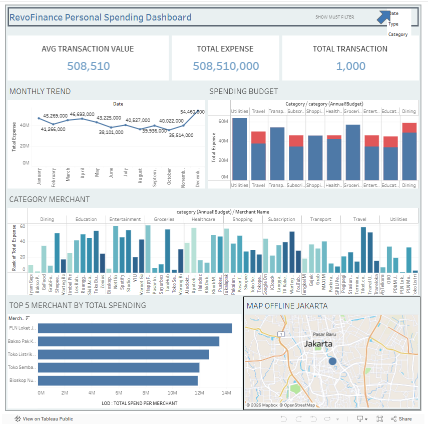

# RevoFinance Personal Finance & Spending Analysis

## SECTION 1: PROJECT SUMMARY FOR PORTFOLIO
### Summary / Context
This multi-phase project focuses on optimizing retail, banking, and fintech operations for RevoGrocers, RevoBank, and RevoFinance. By combining SQL sales analysis, Python customer segmentation, and Tableau visualization, I transformed raw transaction data into strategic frameworks for revenue growth, risk management, and personal expense tracking.

### Goals
The primary objectives were to identify high-revenue drivers and reduce logistics damage for RevoGrocers, segment credit card users by risk and value for RevoBank, and develop a comprehensive visualization suite for RevoFinance to enable users to track spending trends and manage budget utilization.

### Process
I extracted data via SQL to identify lead categories and performed Root Cause Analysis (RCA) for operational failures. Using Python, I conducted K-Means clustering to segment customers into three risk-value profiles. Finally, I built dashboards to visualize merchant spending concentration and seasonal budget spikes using the OBIPR (Observation, Business Impact, Insight, Proposal, Result) framework.

### Output
Identified Confections as a lead driver ($556.93 Million) and clustered RevoBank users to prioritize high-value/low-risk segments. For RevoFinance, I discovered high offline spending concentration in Jakarta and a significant end-of-year spending spike. I recommended seasonal budgeting alerts and targeted merchant partnerships to improve user financial health and platform retention.

Based on these insights, I recommended:
• Seasonal budgeting alerts  
• Merchant partnership optimization  
• Spending monitoring dashboards to improve financial health

# SECTION 2: SCOPE OF WORK / ACHIEVEMENTS (AQS FRAMEWORK)
• Analyzed sales datasets using SQL to identify that the top five product categories generate 52.88% of total company revenue.

• Segmented RevoBank's customer base into 3 distinct clusters using Python K-Means, identifying Cluster 2 as the primary profit driver.

• Designed interactive dashboards for RevoFinance to track spending across 584 unique merchants, identifying high dependency on top-tier service providers.

• Developed a seasonal budgeting strategy that triggers early warning alerts when budget utilization exceeds 80% to prevent year-end overruns.

• Diagnosed a 12% logistics damage rate through 5-Why analysis, proposing standardized temperature-controlled transport to reduce financial waste.

# SECTION 3: TOOLS & METHODS
### A. Tools
• Tableau / Looker Studio / Google Sheets  
• Data Visualization Dashboards  
• Technical Problem Solving (TPS) Framework

### B. Methods
• Customer Segmentation (K-Means Clustering, Elbow Method)  
• Statistical Testing (Pearson Correlation Analysis)  
• OBIPR Analytical Framework  
• Root Cause Analysis (Fishbone Diagram, 5 Why Analysis)  
• Budget Variance Analysis  
• Geospatial Spending Analysis  

## Dataset
The dataset used for financial spending analysis can be accessed below:

[Download Dataset](dataset_finance.xlsx)

### Dataset Source
Synthetic financial transaction dataset used for visualization and spending analysis.
Dashboard:
https://public.tableau.com/app/profile/venny.deslaweny

# SECTION 4: KEY VISUALIZATIONS
## Dashboard Preview

### Elbow Method Plot
Determines the optimal number of clusters (k=3) used for customer segmentation.
### Merchant Spending Concentration Chart
Shows the distribution of spending across merchants, highlighting dependency on key providers.
### Budget Utilization Dashboard
Tracks actual spending against planned budget and triggers alerts when utilization exceeds 80%.
### Fishbone Diagram
Identifies operational causes of the 12% logistics damage rate.
### Price Sensitivity Scatter Plot
Python-generated visualization demonstrating the **-0.82 correlation between product price and sales quantity**.

## KEY INSIGHTS
• Offline spending is heavily concentrated in Jakarta, indicating strong dependency on physical merchants.

• A significant spending spike occurs in December, suggesting seasonal consumption behavior.

• A small number of merchants contribute to a large portion of total spending.

• Budget utilization often exceeds 80% toward the end of the year, increasing financial risk for users.

## BUSINESS IMPACT
This analysis supports data-driven decisions across multiple business domains:
• Revenue optimization  
• Customer risk management  
• Personal finance management  
• Operational efficiency improvement  
The insights enable companies to **optimize marketing strategy, improve customer retention, and support financial health tracking for users.**

## Project Files
finance_dashboard_visual.png → Dashboard visualization

dataset_finance.xlsx → Financial transaction dataset used in the analysis

## Author
Venny Amilia Deslaweny
